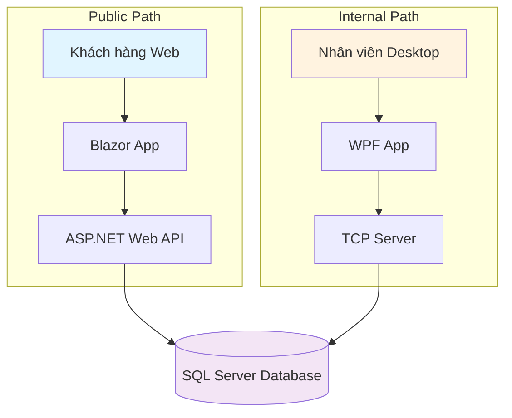

# 🛒 MINIMART SMART SYSTEM (MS2)

[](https://dotnet.microsoft.com/)
[](LICENSE)
[](https://github.com/KieenLee/minimart-smart-system)

> Hệ thống quản lý bán lẻ hiện đại với kiến trúc phân tán, hỗ trợ bán hàng tại quầy (POS) và bán hàng trực tuyến.

## 📋 Mục lục

- [Giới thiệu](#giới-thiệu)
- [Kiến trúc hệ thống](#kiến-trúc-hệ-thống)
- [Công nghệ sử dụng](#công-nghệ-sử-dụng)
- [Tính năng chính](#tính-năng-chính)
- [Yêu cầu hệ thống](#yêu-cầu-hệ-thống)
- [Cài đặt và Chạy](#cài-đặt-và-chạy)
- [Cấu trúc dự án](#cấu-trúc-dự-án)
- [API Documentation](#api-documentation)
- [Đóng góp](#đóng-góp)
- [License](#license)

---

## 🎯 Giới thiệu

**MiniMart Smart System (MS2)** là một hệ thống quản lý bán lẻ toàn diện được thiết kế để giải quyết nhu cầu:
- ✅ Bán hàng tại quầy (Point of Sale - POS) với tốc độ nhanh
- ✅ Bán hàng trực tuyến cho khách hàng
- ✅ Quản lý kho hàng, sản phẩm, nhân viên
- ✅ Báo cáo doanh thu và thống kê

Dự án áp dụng **hệ sinh thái .NET** với kiến trúc phân tán Dual-Path, bao gồm:
- 🌐 **Web Application** (Blazor) - Phục vụ khách hàng online
- 🖥️ **Desktop Application** (WPF) - Phục vụ nhân viên/admin tại quầy
- 🚀 **Backend Servers** - Web API + TCP Server

---

## 🏗️ Kiến trúc hệ thống

### Dual-Path Architecture

Hệ thống được chia thành **hai kênh độc lập**, cùng kết nối chung một Database:

#### 🌐 Flow A: Public Path (Web Application)

```
Blazor App ↔ ASP.NET Web API ↔ Database (EF Core)
```

**Mục đích:**
- Phục vụ khách hàng truy cập từ Internet
- Thực hiện đặt hàng online, xem sản phẩm, lịch sử đơn hàng
- Sử dụng RESTful API với JWT Authentication

#### 🖥️ Flow B: Internal Path (Desktop Application)

```
Desktop App (WPF) ↔ TCP Network (Socket) ↔ ServerApp (Console) ↔ Database
```

**Mục đích:**
- Tối ưu cho nhân viên bán hàng tại quầy (POS)
- Tốc độ phản hồi cực nhanh với TCP/IP
- Khả năng tương tác với thiết bị ngoại vi (máy in, đầu đọc mã vạch)

### Sơ đồ kiến trúc



---

## 💻 Công nghệ sử dụng

### Tech Stack

| Thành phần | Công nghệ |
|------------|-----------|
| **Web UI** | Blazor WebAssembly (ASP.NET Core) |
| **Web Backend** | ASP.NET Core Web API (RESTful) |
| **Desktop Client** | WPF (.NET 8) |
| **Internal Server** | Console App (TCP Listener) |
| **Communication** | System.Net.Sockets (TCP/IP) |
| **Data Access** | Entity Framework Core |
| **Database** | SQL Server |
| **Security** | JWT Bearer Authentication |

### Kỹ thuật & Patterns

- ✅ **Entity Framework Core** với Code-First Migrations
- ✅ **Repository Pattern** + **Unit of Work Pattern**
- ✅ **LINQ** cho data querying
- ✅ **Async/Await** pattern
- ✅ **Dependency Injection** (DI Container)
- ✅ **3-Layer Architecture** (Models, DataAccess, Business Logic)
- ✅ **MVVM Pattern** (trong WPF)
- ✅ **TCP/IP Socket Programming**

---

## ⚡ Tính năng chính

### 🛒 Cho Khách hàng (Web App)
- [x] Đăng ký và đăng nhập tài khoản
- [x] Xem danh sách sản phẩm theo danh mục
- [x] Tìm kiếm sản phẩm
- [x] Thêm s��n phẩm vào giỏ hàng
- [x] Đặt hàng trực tuyến
- [x] Xem lịch sử đơn hàng
- [x] Tích điểm khách hàng thân thiết

### 💼 Cho Nhân viên (Desktop App)
- [x] Đăng nhập hệ thống POS
- [x] Quét mã vạch sản phẩm
- [x] Tạo đơn hàng nhanh tại quầy
- [x] In hóa đơn
- [x] Kiểm tra tồn kho
- [x] Cập nhật giá sản phẩm
- [x] Cập nhật số lượng tồn kho

### 👨‍💼 Cho Admin
- [x] Quản lý nhân viên
- [x] Xem báo cáo doanh thu theo thời gian
- [x] Quản lý danh mục sản phẩm
- [x] Thống kê sản phẩm bán chạy
- [x] Quản lý giá và khuyến mãi

---

## 📦 Yêu cầu hệ thống

### Môi trường phát triển

- **OS:** Windows 10/11 hoặc Linux (cho Web API)
- **IDE:** Visual Studio 2022 hoặc Rider
- **.NET SDK:** 8.0 trở lên
- **Database:** SQL Server 2019+ hoặc SQL Server LocalDB
- **RAM:** Tối thiểu 8GB (khuyến nghị 16GB)

### NuGet Packages (tự động cài khi build)

```xml
<!-- MS2.DataAccess -->
<PackageReference Include="Microsoft.EntityFrameworkCore" Version="8.0.*" />
<PackageReference Include="Microsoft.EntityFrameworkCore.SqlServer" Version="8.0.*" />
<PackageReference Include="Microsoft.EntityFrameworkCore.Tools" Version="8.0.*" />

<!-- MS2.WebAPI -->
<PackageReference Include="Microsoft.AspNetCore.Authentication.JwtBearer" Version="8.0.*" />
<PackageReference Include="Swashbuckle.AspNetCore" Version="6.5.*" />
<PackageReference Include="BCrypt.Net-Next" Version="4.0.*" />

<!-- MS2.BlazorApp -->
<PackageReference Include="Blazored.LocalStorage" Version="4.5.*" />

<!-- MS2.DesktopApp -->
<PackageReference Include="CommunityToolkit.Mvvm" Version="8.2.*" />
```

---

## 🚀 Cài đặt và Chạy

### 1️⃣ Clone Repository

```bash
git clone https://github.com/KieenLee/minimart-smart-system.git
cd minimart-smart-system
```

### 2️⃣ Cấu hình Database

Mở file `appsettings.json` trong các project và cập nhật connection string:

```json
{
  "ConnectionStrings": {
    "DefaultConnection": "Server=(localdb)\\mssqllocaldb;Database=MS2Database;Trusted_Connection=True;"
  }
}
```

### 3️⃣ Chạy Migrations

```bash
cd MS2.DataAccess
dotnet ef database update --startup-project ../MS2.DataAccess
```

### 4️⃣ Seed Sample Data

```bash
# Sẽ tự động chạy khi khởi động application lần đầu
# Hoặc chạy manual trong Program.cs
```

### 5️⃣ Chạy ứng dụng

#### Chạy Web API (Flow A)

```bash
cd MS2.WebAPI
dotnet run
```

Truy cập Swagger UI tại: `https://localhost:7000/swagger`

#### Chạy Blazor App (Flow A)

```bash
cd MS2.BlazorApp
dotnet run
```

Truy cập tại: `https://localhost:7001`

#### Chạy TCP Server (Flow B)

```bash
cd MS2.ServerApp
dotnet run
```

Server sẽ lắng nghe tại: `127.0.0.1:5000`

#### Chạy WPF Desktop App (Flow B)

```bash
cd MS2.DesktopApp
dotnet run
```

Hoặc mở `MS2.sln` trong Visual Studio và chạy project `MS2.DesktopApp`.

---

## 📁 Cấu trúc dự án

```
minimart-smart-system/
│
├── MS2.Models/                      # Shared Models & DTOs
│   ├── Entities/                   # Domain entities
│   │   ├── User.cs
│   │   ├── Product.cs
│   │   ├── Order.cs
│   │   └── ...
│   └── DTOs/                       # Data Transfer Objects
│       ├── LoginRequestDto.cs
│       ├── ProductDto.cs
│       └── ...
│
├── MS2.DataAccess/                 # Data Access Layer
│   ├── MS2DbContext.cs             # EF Core DbContext
│   ├── Interfaces/                 # Repository interfaces
│   ├── Repositories/               # Repository implementations
│   └── Migrations/                 # EF Core migrations
│
├── MS2.WebAPI/                     # ASP.NET Core Web API
│   ├── Controllers/                # API Controllers
│   │   ├── AuthController.cs
│   │   ├── ProductsController.cs
│   │   └── OrdersController.cs
│   ├── Services/                   # Business services
│   └── appsettings.json
│
├── MS2.BlazorApp/                  # Blazor WebAssembly App
│   ├── Pages/                      # Blazor pages
│   │   ├── Login.razor
│   │   ├── Products.razor
│   │   └── Checkout.razor
│   ├── Components/                 # Reusable components
│   └── Services/                   # HTTP services
│
├── MS2.ServerApp/                  # TCP Server Console App
│   ├── Services/                   # TCP Server implementation
│   │   └── TcpServer.cs
│   ├── Handlers/                   # Message handlers
│   │   └── TcpMessageHandler.cs
│   └── Program.cs
│
└── MS2.DesktopApp/                 # WPF Desktop App
    ├── Views/                      # XAML views
    │   ├── LoginWindow.xaml
    │   ├── MainWindow.xaml
    │   └── POSView.xaml
    ├── ViewModels/                 # MVVM ViewModels
    └── Services/                   # TCP Network service
        └── TcpNetworkService.cs
```

---

## 📚 API Documentation

### Authentication Endpoints

#### POST /api/auth/login
Đăng nhập hệ thống

**Request:**
```json
{
  "username": "admin",
  "password": "admin123"
}
```

**Response:**
```json
{
  "token": "eyJhbGciOiJIUzI1NiIsInR5cCI6IkpXVCJ9...",
  "username": "admin",
  "role": "Admin",
  "expiresAt": "2026-02-09T10:00:00Z"
}
```

#### POST /api/auth/register
Đăng ký tài khoản mới

**Request:**
```json
{
  "username": "customer1",
  "email": "customer1@example.com",
  "password": "password123",
  "fullName": "Nguyễn Văn A",
  "phone": "0123456789"
}
```

### Products Endpoints

#### GET /api/products
Lấy danh sách tất cả sản phẩm

**Response:**
```json
[
  {
    "id": 1,
    "name": "Coca Cola 330ml",
    "price": 10000,
    "stock": 100,
    "barcode": "8934588000001",
    "categoryId": 1
  }
]
```

#### GET /api/products/{id}
Lấy thông tin sản phẩm theo ID

#### GET /api/products/search?keyword={keyword}
Tìm kiếm sản phẩm

#### POST /api/products
Tạo sản phẩm mới (Admin only)

**Headers:**
```
Authorization: Bearer {token}
```

### Orders Endpoints

#### GET /api/orders
Lấy danh sách đơn hàng của khách hàng (Authenticated)

#### POST /api/orders
Tạo đơn hàng mới

**Request:**
```json
{
  "items": [
    {
      "productId": 1,
      "quantity": 2
    }
  ],
  "deliveryAddress": "123 Đường ABC",
  "phone": "0123456789"
}
```

### TCP Protocol Actions

#### LOGIN
Đăng nhập qua TCP

**Message:**
```json
{
  "action": "LOGIN",
  "data": {
    "username": "admin",
    "password": "admin123"
  }
}
```

#### GET_PRODUCTS
Lấy danh sách sản phẩm

#### GET_PRODUCT_BY_BARCODE
Quét mã vạch

#### CREATE_ORDER
Tạo đơn hàng POS

[Xem thêm trong file `plan.md`](plan.md)

---

## 🧪 Testing

### Unit Tests

```bash
dotnet test
```

### Integration Tests

```bash
# Test Web API
cd MS2.WebAPI.Tests
dotnet test

# Test TCP Server
cd MS2.ServerApp.Tests
dotnet test
```

### Manual Testing

1. **Postman Collection:** Import file `MS2.postman_collection.json` (nếu có)
2. **Swagger UI:** Truy cập `/swagger` để test API interactively
3. **Desktop App:** Chạy WPF app và test POS flow

---

## 🎨 Screenshots

### Web Application (Blazor)

*(Thêm screenshots của Blazor app ở ��ây)*

### Desktop Application (WPF)

*(Thêm screenshots của WPF POS app ở đây)*

---

## 🤝 Đóng góp

Chúng tôi rất hoan nghênh mọi đóng góp! Vui lòng làm theo các bước sau:

1. Fork repository
2. Tạo branch mới (`git checkout -b feature/AmazingFeature`)
3. Commit changes (`git commit -m 'Add some AmazingFeature'`)
4. Push to branch (`git push origin feature/AmazingFeature`)
5. Mở Pull Request

### Quy tắc Coding

- Tuân thủ [C# Coding Conventions](https://docs.microsoft.com/en-us/dotnet/csharp/fundamentals/coding-style/coding-conventions)
- Viết unit tests cho code mới
- Cập nhật documentation khi cần

---


## 👨‍💻 Tác giả

**Kieen Lee**
- GitHub: [@KieenLee](https://github.com/KieenLee)

---

## 🙏 Acknowledgments

- [Entity Framework Core](https://docs.microsoft.com/en-us/ef/core/)
- [ASP.NET Core](https://docs.microsoft.com/en-us/aspnet/core/)
- [Blazor](https://dotnet.microsoft.com/apps/aspnet/web-apps/blazor)
- [WPF](https://docs.microsoft.com/en-us/dotnet/desktop/wpf/)
- [CommunityToolkit.Mvvm](https://github.com/CommunityToolkit/dotnet)
